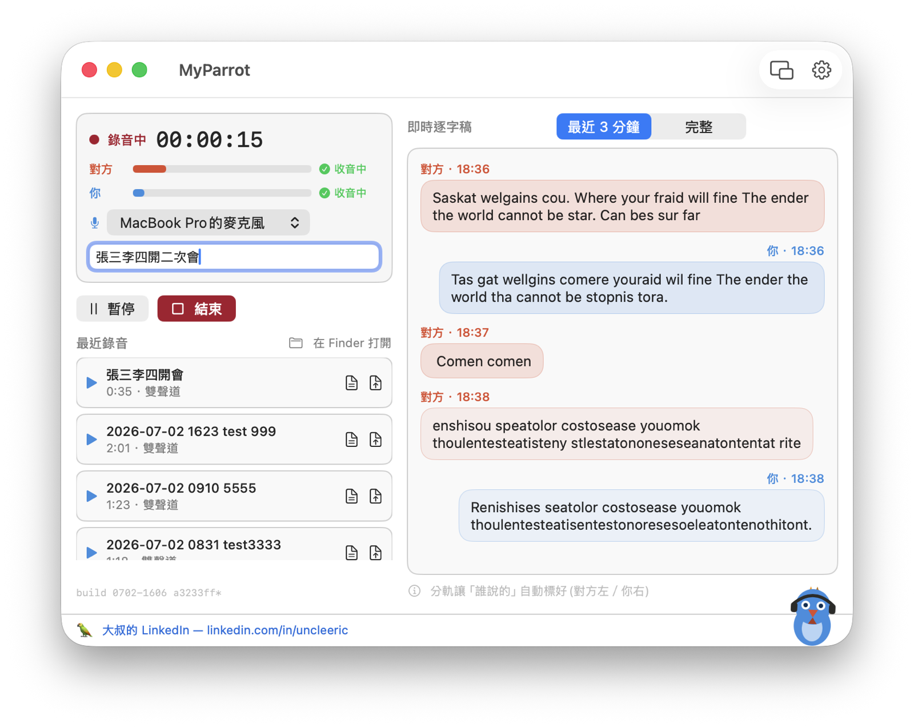
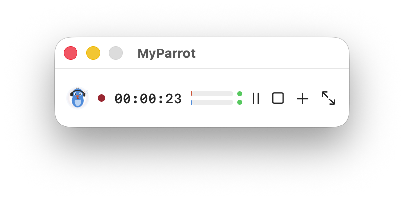

# 🦜 MyParrot

**Bot-free 的 macOS 會議錄音 + 逐字稿 app。** 把線上會議的雙方錄進同一個立體聲檔——**對方=左聲道、你=右聲道**,每句話天生就標好講者。不用 diarization 模型、不用機器人進會議、所有資料不離開你的 Mac。

[English README →](README.md)





## 為什麼分軌?

會議逐字稿最難的是「誰說了什麼」。MyParrot 用物理繞過機器學習:對方走系統音訊 tap、你走麥克風,各佔一個聲道。拆軌、各自辨識、按時間交織——講者歸屬零錯誤,完全離線。

## 功能

- **對方聲音** — Core Audio **Process Tap**(macOS 14.4+):不裝驅動、不裝核心擴充、不建虛擬音訊裝置
- **你的聲音** — AVAudioEngine 麥克風擷取,**錄音中裝置/路由變更也不斷**(configuration-change 自癒 + 心跳看門狗;錄音中熱切換麥克風、檔案保持連續)
- **即時逐字稿** — macOS 26 SpeechAnalyzer(長時串流),舊系統自動 fallback SFSpeechRecognizer
- **舊錄音轉逐字稿** → `.txt` + 帶時間碼、講者前綴的 `.srt`
- **離線回音消除**(選用、非破壞式——另存 `*_aec.m4a`,原檔永不被動)
- CAF→m4a 自動轉檔、錄音中防誤關、懸浮迷你模式、增益+軟限幅
- 介面:繁中/簡中/英/日/韓
- 主畫面左下 **build 標記**,永遠知道自己跑的是哪一版

## 需求

- **macOS 14.4+**(系統音訊 Process Tap)——**建議 26.1+**(即時逐字稿;26.0 有已知 process-tap regression)
- **Swift 6 工具鏈** — **Command Line Tools 就夠** build、跑、自測;只有 `swift test` 需要完整 Xcode

## 快速開始

```bash
git clone <this-repo> && cd MyParrot
swift build                 # 編譯驗證
bash scripts/build-app.sh   # 組裝、簽章、裝到 ~/Applications
open ~/Applications/MyParrot.app
```

首次啟動會要 **麥克風**、**語音辨識**、**系統音訊擷取** 三個權限(**不會**要螢幕錄製)。

## ⚠️ 常見坑(先讀,省你一小時)

1. **簽章與權限記憶。** macOS 的權限(TCC)綁簽章身份。`build-app.sh` 自動選最好的:Apple Development / Developer ID 憑證(有 Team ID → **重 build 權限不重問**)→ 自簽 → ad-hoc(**每次重 build 都重問**)。只要鑰匙圈裡有 Apple 憑證,腳本會自己找到。
2. **`.app` 別放 iCloud 同步目錄。** iCloud Drive 會反覆重貼 Finder xattr、弄壞簽章——所以腳本裝到 `~/Applications`。
3. **麥克風別用藍牙耳機。** 任何 app 一開藍牙麥,整條藍牙鏈路就從 A2DP 掉到窄頻 HFP——**連對方的聲音都跟著變電話音質**。耳機拿來聽,講話用內建/有線/USB 麥。(自動選麥已避開藍牙;手動選仍可,但會警告。)

## 已知限制

| 項目 | 現況 |
| --- | --- |
| 長會議(>30 分) | 兩個擷取時鐘緩慢漂移;取樣級同步規劃中 |
| 藍牙耳機當輸出+任一 app 佔用藍牙麥 | 電話音質天花板——HFP 協定限制,軟體救不了 |
| 錄音中切「到」藍牙麥 | 切換瞬間一聲爆音(OS profile 切換) |
| <0.3 秒的短暫擷取中斷 | 不補零(換來零 click);該窗口內該軌可能前移 ≤0.3s |
| 回音消除 | 離線後製、預設關 |

## 法律

多數法域錄音需事先告知/取得同意。**使用者自行負責**遵守所在地法規。

## 架構

檔案地圖見 [英文版 README](README.md#architecture);測試金字塔與驗證方式見 [docs/TESTING.md](docs/TESTING.md)。

## License

MIT © 2026 Eric Lu — 見 [LICENSE](LICENSE)。
